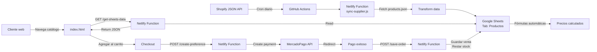

# SW4 - Sistema de Inventario y Catálogo de Perfumes

**Proyecto:** Sistema automatizado de gestión de inventario y catálogo
**Cliente Potencial:** Amigo de Gonza - Venta de perfumes al detal y al mayor
**Estado:** 🚀 IN DEVELOPMENT - Prototipo completo (Cliente confirmó inicio)
**Fecha Inicio:** 13 Octubre 2025
**Elaborado por:** Mentat, Chief Automation Architect @ Skywalking.dev

---

## 📊 Contexto del Negocio

### Cliente
- **Rubro:** Venta de perfumes (retail + wholesale)
- **Mercado:** Venezuela
- **Canales:** Al detal + Al mayor
- **Proveedor:** Internacional (con catálogo web)

### Pain Points Identificados

El cliente describe su proceso actual:

> "Es Excel, es la lista de mi proveedor con los precios y en base a esos precios, yo tengo que sacar mi costo que me cuesta ponerlos aquí en Venezuela flete mi margen de utilidad, yo con eso saco mis precios para vender al mayor para vender al detal. Con ese Excel yo busco las fotos en la página del proveedor para hacer el catálogo que yo hago entonces nada, si algo que yo pudiera automatizar, por decirlo de alguna forma es coño para llevar inventario, que podamos hacer un inventario inicial con lo que yo tenga, yo hago con ese Excel, hago la lista y después cada vez que vaya a recomprando irlo añadiendo y cada vez que venda irlo descontando, eso es como que es el proceso que más me ladilla a mí del trabajo, o sea o no es lo que más me ladilla, si no es lo que más me quita tiempo."

#### Problemas Críticos (priorizados por tiempo invertido):

1. **🧮 Cálculo de precios** (Alto esfuerzo manual)
   - Recibe Excel del proveedor con precios base
   - Debe calcular: costo + flete + margen mayorista + margen detallista
   - Proceso repetitivo para cada producto
   - Propenso a errores humanos

2. **📸 Extracción de imágenes** (Alto tiempo invertido)
   - Buscar manualmente cada producto en web del proveedor
   - Descargar fotos una por una
   - Organizarlas para el catálogo
   - Tiempo: ~5-10min por producto

3. **📦 Gestión de inventario** (El que más le quita tiempo)
   - Inventario inicial manual
   - **Sumar** al recomprar
   - **Restar** al vender
   - No tiene sistema, todo en Excel
   - Riesgo de desincronización

#### Impacto en el Negocio:
- ⏱️ **Tiempo perdido:** 2-4 horas diarias en tareas manuales
- 💰 **Errores de precio:** Pérdida de margen o precios no competitivos
- 📊 **Falta de visibilidad:** No sabe qué se vende más, qué recomprar
- 🚫 **No escalable:** No puede crecer sin contratar ayuda

---

## 🔍 Análisis: ¿Cómo usar SW3?

### ✅ SW3 SuperHotdog/MangoBajito SÍ sirve como base (20% reutilizable)

**ACTUALIZACIÓN:** Después de validar que el cliente SÍ quiere vender online con checkout, sw3 es viable como base.

| Característica | sw3 (Restaurante) | Perfumes (Necesidad Real) | Match |
|----------------|-------------------|---------------------------|-------|
| **Modelo de negocio** | B2C (restaurante → cliente final) | B2B + B2C (proveedor → él → clientes mayoristas/detal) | ✅ |
| **Catálogo** | Fijo, actualización manual en Sheets | Dinámico, sync automático desde proveedor Shopify | ✅ |
| **Precios** | Precio fijo por producto | Cálculo con fórmulas en Google Sheets | ✅ |
| **Imágenes** | Subida manual | Sync automático desde Shopify CDN | ✅ |
| **Inventario** | Solo decremento (ventas) | ➕ Agregar: incremento (compras) | ⚠️ |
| **Carrito de compras** | ✅ Sistema completo | ✅ Lo necesita (vende online) | ✅ |
| **Pagos online** | ✅ MercadoPago | ✅ Venezuela también usa MP | ✅ |
| **Horarios de apertura** | ✅ Sistema dinámico | ❌ No aplica (código innecesario) | ⚠️ |
| **WhatsApp** | Confirmación de pedidos | ✅ Notificaciones útiles | ✅ |
| **Generación de catálogo** | ❌ No tiene | ➕ Agregar: Netlify Function PDF | ⚠️ |

**Conclusión:** 20% del código de sw3 es directamente útil (frontend + estructura). 80% hay que crearlo (sync, precios, inventario bidireccional).

### 💰 ROI de Adaptar sw3 vs Solución Específica

| Métrica | Híbrido sw3+Código ⭐ | Solo n8n | Micro-app Específica |
|---------|---------------------|----------|----------------------|
| **Tiempo desarrollo** | **8 horas** | 30-40h | 40h |
| **Costo estimado** | **$300-400** | $800-1,000 | $1,000 |
| **Código reutilizado sw3** | **20%** | 0% | 5% |
| **Código nuevo** | **60%** | 100% | 90% |
| **Código innecesario** | **20%** | 0% | 5% |
| **Infraestructura mensual** | **$0** (Netlify gratis) | $20/mes (n8n cloud) | $0-10/mes |
| **Mantenibilidad** | ⭐⭐⭐⭐ Alta | ⭐⭐⭐⭐⭐ Alta | ⭐⭐⭐⭐ Alta |
| **Escalabilidad** | ⭐⭐⭐⭐ Buena | ⭐⭐⭐⭐⭐ Excelente | ⭐⭐⭐⭐ Buena |
| **ROI** | ⭐⭐⭐⭐⭐ **Excelente** | ⭐⭐⭐⭐ Bueno | ⭐⭐⭐⭐ Bueno |

**Veredicto:** La opción híbrida (sw3 + Netlify Functions) es la más eficiente: reutiliza frontend probado, $0 de infraestructura, y 8 horas de desarrollo.

---

## 🎯 Propuesta de Solución: 3 Opciones

### Opción 1: Híbrido sw3 + Netlify Functions ⭐ **RECOMENDADA**

```
📋 Tiempo: 1 día (8 horas)
💰 Costo: $300-400 USD
🎯 ROI: ⭐⭐⭐⭐⭐
👥 Requiere: Mentat (4h) + Gonza (4h)
```

**Contexto del proveedor:**
- **Nombre:** Alberto Cortés
- **Plataforma:** Shopify (https://albertocortes.com/)
- **Catálogo:** ~200 productos
- **Ventaja:** Tiene endpoints JSON públicos (`.json` API nativa de Shopify)

#### ✅ Por qué SÍ:
- **Aprovecha sw3 existente:** Frontend + MercadoPago + estructura probada (20% reutilización)
- **$0/mes infraestructura:** Netlify Free tier + Google Sheets gratis
- **No requiere n8n:** Todo en Netlify Functions (serverless)
- **MercadoPago funciona en Venezuela:** Pagos online ya resueltos
- **Shopify JSON API:** No necesita Playwright, solo `fetch()`
- **Rápido:** 8 horas totales entre ambos
- **Escalable:** GitHub Actions para crons gratuitos

#### ⚠️ Por qué NO:
- Reutiliza 20% de código innecesario (horarios de apertura, etc.)
- No es una solución "perfecta" pero es la más rápida

#### Stack Tecnológico:
```yaml
frontend:
  - HTML/CSS/JS (de sw3)
  - Google Fonts
  - MercadoPago SDK

backend:
  - Netlify Functions (Node.js serverless)
  - Google Sheets API v4

automation:
  - GitHub Actions (crons gratuitos)

storage:
  - Google Sheets (base de datos)
  - Shopify CDN (imágenes, no las copiamos)

integrations:
  - Shopify JSON API (productos.json)
  - Google Sheets API (inventario)
  - MercadoPago API (pagos)
```

#### Arquitectura Simplificada:



**Flujo de datos:**
1. **Sync automático:** GitHub Actions ejecuta cron → Netlify Function fetch Shopify → Actualiza Google Sheets
2. **Navegación:** Cliente consulta catálogo → Frontend lee de Sheets → Muestra productos
3. **Compra:** Cliente compra → MercadoPago → Webhook actualiza stock en Sheets

#### Código de Netlify Functions:

##### 1. **`netlify/functions/sync-supplier.js`** - Sincroniza catálogo desde Shopify

```javascript
// Netlify Function que fetchea productos de Shopify y actualiza Google Sheets
// Ejecutado por GitHub Actions cron diario

const { google } = require('googleapis');

exports.handler = async (event, context) => {
  const headers = {
    'Access-Control-Allow-Origin': '*',
    'Access-Control-Allow-Headers': 'Content-Type',
    'Access-Control-Allow-Methods': 'GET, POST, OPTIONS'
  };

  if (event.httpMethod === 'OPTIONS') {
    return { statusCode: 200, headers };
  }

  try {
    // 1. Fetch productos de Shopify JSON API
    const response = await fetch('https://albertocortes.com/products.json?limit=250');
    if (!response.ok) throw new Error(`Shopify API error: ${response.status}`);

    const data = await response.json();
    console.log(`✅ Fetched ${data.products.length} products from Shopify`);

    // 2. Transform datos a formato de Google Sheets
    const productos = data.products.map(p => {
      const variant = p.variants[0];
      return [
        variant.sku || p.id.toString(),           // A: SKU
        p.title,                                  // B: Nombre
        p.vendor,                                 // C: Marca
        parseFloat(variant.price),                // D: Precio USD
        variant.inventory_quantity || 0,          // E: Stock proveedor
        p.images[0]?.src || '',                   // F: Imagen URL
        new Date().toISOString()                  // G: Fecha sync
      ];
    });

    // 3. Actualizar Google Sheets
    const auth = new google.auth.GoogleAuth({
      credentials: JSON.parse(process.env.GOOGLE_SERVICE_ACCOUNT_JSON),
      scopes: ['https://www.googleapis.com/auth/spreadsheets'],
    });

    const sheets = google.sheets({ version: 'v4', auth });
    const SHEET_ID = process.env.GOOGLE_SHEET_ID;

    // Clear y reemplazar datos
    await sheets.spreadsheets.values.clear({
      spreadsheetId: SHEET_ID,
      range: 'Productos!A2:G',
    });

    await sheets.spreadsheets.values.append({
      spreadsheetId: SHEET_ID,
      range: 'Productos!A2',
      valueInputOption: 'RAW',
      resource: { values: productos },
    });

    console.log(`✅ Updated ${productos.length} products in Google Sheets`);

    return {
      statusCode: 200,
      headers,
      body: JSON.stringify({
        success: true,
        productsUpdated: productos.length,
        lastSync: new Date().toISOString()
      })
    };

  } catch (error) {
    console.error('❌ Sync error:', error);
    return {
      statusCode: 500,
      headers,
      body: JSON.stringify({ error: error.message })
    };
  }
};
```

##### 2. **`netlify/functions/save-order.js`** - Modificado para decrementar stock

```javascript
// Basado en sw3, modificado para manejar stock
// URL: /.netlify/functions/save-order

const { google } = require('googleapis');

exports.handler = async (event, context) => {
  const headers = {
    'Access-Control-Allow-Origin': '*',
    'Access-Control-Allow-Headers': 'Content-Type',
    'Access-Control-Allow-Methods': 'POST, OPTIONS'
  };

  if (event.httpMethod === 'OPTIONS') {
    return { statusCode: 200, headers };
  }

  if (event.httpMethod !== 'POST') {
    return { statusCode: 405, headers, body: 'Method not allowed' };
  }

  try {
    const { orderId, customer, items, total, paymentId } = JSON.parse(event.body);

    const auth = new google.auth.GoogleAuth({
      credentials: JSON.parse(process.env.GOOGLE_SERVICE_ACCOUNT_JSON),
      scopes: ['https://www.googleapis.com/auth/spreadsheets'],
    });

    const sheets = google.sheets({ version: 'v4', auth });
    const SHEET_ID = process.env.GOOGLE_SHEET_ID;

    // 1. Guardar orden en tab "Pedidos"
    await sheets.spreadsheets.values.append({
      spreadsheetId: SHEET_ID,
      range: 'Pedidos!A:H',
      valueInputOption: 'RAW',
      resource: {
        values: [[
          orderId,
          new Date().toISOString(),
          customer.name,
          customer.email,
          JSON.stringify(items),
          total,
          'mercadopago',
          paymentId
        ]]
      }
    });

    // 2. Decrementar stock de cada producto
    // Leer inventario actual
    const inventoryResponse = await sheets.spreadsheets.values.get({
      spreadsheetId: SHEET_ID,
      range: 'Productos!A:E',
    });

    const rows = inventoryResponse.data.values;
    const updates = [];

    items.forEach(item => {
      const rowIndex = rows.findIndex(row => row[0] === item.sku); // Buscar por SKU
      if (rowIndex >= 0) {
        const currentStock = parseInt(rows[rowIndex][4]) || 0;
        const newStock = currentStock - item.quantity;

        updates.push({
          range: `Productos!E${rowIndex + 1}`,
          values: [[newStock]]
        });
      }
    });

    // Batch update stocks
    if (updates.length > 0) {
      await sheets.spreadsheets.values.batchUpdate({
        spreadsheetId: SHEET_ID,
        resource: { data: updates, valueInputOption: 'RAW' }
      });
    }

    console.log(`✅ Order ${orderId} saved, ${updates.length} stocks updated`);

    return {
      statusCode: 200,
      headers,
      body: JSON.stringify({ success: true, orderId, stocksUpdated: updates.length })
    };

  } catch (error) {
    console.error('❌ Save order error:', error);
    return {
      statusCode: 500,
      headers,
      body: JSON.stringify({ error: error.message })
    };
  }
};
```

##### 3. **`.github/workflows/sync-catalog.yml`** - Cron diario

```yaml
name: Sync Supplier Catalog

on:
  schedule:
    - cron: '0 6 * * *'  # Diario a las 6am UTC (3am Argentina)
  workflow_dispatch:     # Manual trigger también

jobs:
  sync:
    runs-on: ubuntu-latest
    steps:
      - name: Trigger Netlify Function
        run: |
          curl -X POST "https://tu-dominio.netlify.app/.netlify/functions/sync-supplier" \
               -H "Content-Type: application/json"
```

#### Estructura de Google Sheets:

##### Tab: **Productos** (A1:K)
| Col | Campo | Tipo | Ejemplo | Descripción |
|-----|-------|------|---------|-------------|
| A | SKU | Text | `AC-123` | Código único del proveedor |
| B | Nombre | Text | `Perfume Chanel No.5 100ml` | Nombre del producto |
| C | Marca | Text | `Chanel` | Marca del producto |
| D | Precio_USD | Number | `100` | Precio del proveedor en USD |
| E | Stock_Propio | Number | `25` | Stock actual (decrementado por ventas) |
| F | Imagen_URL | URL | `https://cdn.shopify.com/...` | URL de Shopify CDN |
| G | Fecha_Sync | DateTime | `2025-10-13T10:30:00Z` | Última sincronización |
| H | Precio_Mayor_USD | **Formula** | `=(D2+Config!$B$2)*(1+Config!$B$3)` | Costo + flete + margen mayor |
| I | Precio_Detal_USD | **Formula** | `=(D2+Config!$B$2)*(1+Config!$B$4)` | Costo + flete + margen detal |
| J | Precio_Mayor_VES | **Formula** | `=H2*Config!$B$1` | Precio mayor × tasa |
| K | Precio_Detal_VES | **Formula** | `=I2*Config!$B$1` | Precio detal × tasa |

**Fórmulas ejemplo para fila 2:**
```
H2: =(D2+Config!$B$2)*(1+Config!$B$3/100)
I2: =(D2+Config!$B$2)*(1+Config!$B$4/100)
J2: =H2*Config!$B$1
K2: =I2*Config!$B$1
```

##### Tab: **Pedidos** (A1:H)
| Col | Campo | Tipo | Descripción |
|-----|-------|------|-------------|
| A | ID_Pedido | Text | Formato: `SHD-20251013-001` |
| B | Fecha | DateTime | ISO timestamp |
| C | Cliente_Nombre | Text | Nombre del cliente |
| D | Cliente_Email | Text | Email del cliente |
| E | Items_JSON | Text | JSON stringificado de productos |
| F | Total | Number | Total en VES o USD |
| G | Metodo_Pago | Text | `mercadopago` |
| H | Pago_ID | Text | ID de MercadoPago |

##### Tab: **Config** (A1:B)
| Row | Parametro | Valor |
|-----|-----------|-------|
| 1 | `tasa_usd_ves` | `36.5` |
| 2 | `flete_usd` | `5` |
| 3 | `margen_mayor_%` | `30` |
| 4 | `margen_detal_%` | `50` |
| 5 | `stock_minimo` | `5` |

**Ventaja de Google Sheets con fórmulas:**
- Los precios se actualizan automáticamente al cambiar tasa o márgenes
- No requiere código para recalcular
- Cliente puede modificar márgenes sin tocar código

---

### Opción 2: Micro-App Específica

```
📋 Tiempo: 1 semana (40 horas)
💰 Costo: $800-1,000 USD
🎯 ROI: ⭐⭐⭐⭐
👥 Requiere: 1 fullstack developer
```

#### Stack:
```yaml
frontend:
  - Next.js 14 + TypeScript
  - Tailwind CSS
  - Shadcn/ui

backend:
  - Next.js API Routes
  - Supabase (PostgreSQL + Storage)

automation:
  - n8n (solo para scraping y procesamiento Excel)

deployment:
  - Vercel (frontend + API)
  - Railway (n8n)
```

#### Características:
- ✅ Dashboard web para gestión
- ✅ Upload de Excel con preview
- ✅ Vista de inventario en tiempo real
- ✅ Generación de catálogos (PDF/WhatsApp)
- ✅ Reportes de ventas y stock
- ✅ Base de datos PostgreSQL (más robusta que Sheets)

#### ✅ Por qué SÍ:
- Interfaz amigable para el cliente
- Base de datos real (escalable)
- Puede crecer a multi-usuario
- Reportes y analytics integrados

#### ⚠️ Por qué NO:
- Más tiempo de desarrollo
- Requiere más mantenimiento
- Más caro que workflow puro

---

### Opción 3: Solo n8n (descartada)

```
📋 Tiempo: 30-40 horas
💰 Costo: $800-1,000 USD + $20/mes hosting
🎯 ROI: ⭐⭐⭐
```

#### ⚠️ Por qué NO (comparado con híbrido):
- Requiere n8n hosting ($20/mes vs $0 de Netlify)
- Sin frontend de compras (cliente sí quiere vender online)
- Mayor tiempo de desarrollo (30-40h vs 8h)
- Menos reutilización de código existente

---

## 📋 Plan de Trabajo Detallado (Opción 1 - Híbrido)

**Total:** 8 horas (Mentat 4h + Gonza 4h) en 3 sesiones de trabajo

---

### **Sesión 1: Setup & Sync Supplier** (~3 horas)

#### Mentat hace (2h):
- [ ] **Clonar sw3 y crear repo nuevo** (15min)
  - Fork de sw3_superhotdog
  - Rename a `perfumes-inventory`
  - Limpiar código innecesario (horarios, closed-banner)

- [ ] **Crear Google Sheet con estructura** (30min)
  - 3 tabs: Productos, Pedidos, Config
  - Headers y fórmulas ejemplo
  - Configurar Service Account
  - Compartir sheet con service account email

- [ ] **Escribir `sync-supplier.js`** (1h)
  - Fetch Shopify JSON API
  - Transform data a formato de Sheets
  - Update Google Sheets via API
  - Testing con albertocortes.com

- [ ] **GitHub Actions workflow** (15min)
  - Crear `.github/workflows/sync-catalog.yml`
  - Cron diario 6am UTC
  - Manual dispatch trigger

#### Gonza hace (1h):
- [ ] **Setup Netlify** (30min)
  - Crear nuevo site en Netlify
  - Conectar repo de GitHub
  - Deploy inicial

- [ ] **Configurar variables de entorno** (15min)
  - `GOOGLE_SHEET_ID`
  - `GOOGLE_SERVICE_ACCOUNT_JSON`
  - `MP_ACCESS_TOKEN`

- [ ] **Testing del sync** (15min)
  - Ejecutar manual trigger de GitHub Actions
  - Validar que productos se cargan en Sheet
  - Verificar imágenes desde Shopify CDN

**Output:**
- ✅ Sync automático funcionando
- ✅ Google Sheets poblado con ~200 productos
- ✅ Fórmulas de precios calculando correctamente

---

### **Sesión 2: Frontend & Checkout** (~3 horas)

#### Mentat hace (1.5h):
- [ ] **Modificar `get-sheets-data.js`** (30min)
  - Leer columnas A-K (incluye precios calculados)
  - Return JSON con productos + config
  - Testing local con `netlify dev`

- [ ] **Adaptar frontend `index.html`** (45min)
  - Remover lógica de horarios
  - Ajustar categorías para perfumes
  - Mostrar precios mayorista/detal
  - Agregar filtro por marca
  - Testing visual

- [ ] **Modificar `save-order.js`** (15min)
  - Agregar lógica de decremento de stock
  - Batch update a columna E (Stock_Propio)
  - Testing con orden simulada

#### Gonza hace (1.5h):
- [ ] **Configurar MercadoPago** (30min)
  - Validar que token funciona en Venezuela
  - Testing de `create-preference.js` existente
  - Crear orden de prueba

- [ ] **Testing de flujo completo** (45min)
  - Navegar catálogo
  - Agregar productos al carrito
  - Completar checkout
  - Verificar orden en Sheet "Pedidos"
  - Verificar decremento de stock

- [ ] **Ajustes de UI/UX** (15min)
  - Revisar responsive en móvil
  - Ajustar textos (perfumes vs hot dogs)
  - Logo placeholder

**Output:**
- ✅ Sitio web funcional
- ✅ Checkout con MercadoPago funcionando
- ✅ Stock decrementándose automáticamente

---

### **Sesión 3: Polish & Deploy** (~2 horas)

#### Mentat hace (1h):
- [ ] **Optimizaciones finales** (30min)
  - Agregar loading states
  - Mejorar manejo de errores
  - Agregar filtro por rango de precio
  - Cache de Google Sheets (5min TTL)

- [ ] **Documentación** (30min)
  - README con setup instructions
  - Variables de entorno requeridas
  - Cómo actualizar márgenes en Config sheet
  - Troubleshooting común

#### Gonza hace (1h):
- [ ] **Deploy a producción** (20min)
  - Custom domain (opcional)
  - HTTPS configurado
  - Testing en producción

- [ ] **Capacitación del cliente** (30min)
  - Cómo modificar tasa/márgenes en Sheet
  - Cómo ver pedidos
  - Cómo ejecutar sync manual
  - Acceso al dashboard de Netlify

- [ ] **Handoff** (10min)
  - Entregar credenciales
  - Link a documentación
  - Plan de soporte (WhatsApp para dudas)

**Output:**
- ✅ Sitio en producción
- ✅ Cliente capacitado
- ✅ Documentación entregada

---

## 📊 Estimación de Esfuerzo Total

| Sesión | Mentat | Gonza | Total | Cuándo |
|--------|--------|-------|-------|--------|
| **Sesión 1: Setup & Sync** | 2h | 1h | 3h | Día 1 mañana |
| **Sesión 2: Frontend** | 1.5h | 1.5h | 3h | Día 1 tarde |
| **Sesión 3: Deploy** | 1h | 1h | 2h | Día 2 mañana |
| **TOTAL** | **4.5h** | **3.5h** | **8h** | **1.5 días** |

### 💰 Costo Estimado

**Modelo de suscripción mensual:**
- Setup inicial: **$300 USD** (una vez)
- Suscripción mensual: **$20 USD/mes**
  - Incluye: hosting, soporte, ajustes menores
  - Infraestructura: $0 (Netlify + GitHub gratis)
  - Margen: $20/mes por cliente

**Modelo de pago único:**
- Setup completo: **$400 USD** (una vez)
- Infraestructura: **$0/mes** (cliente maneja)
- Soporte: A demanda ($50/hora)

### 📈 ROI Esperado

**Para el cliente:**
- **Tiempo ahorrado:** 2-3 horas/día en tareas manuales
- **Errores reducidos:** Precios siempre actualizados automáticamente
- **Escalabilidad:** Puede crecer sin contratar ayuda

**Para Skywalking:**
- **Desarrollo:** 8 horas × $50/h = $400 (costo interno)
- **Ingreso:** $300-400 setup + $20/mes recurrente
- **Break-even:** Inmediato
- **LTV (12 meses):** $300 + ($20 × 12) = **$540 USD**

---

## ✅ Checklist de Información Necesaria

### Para empezar el proyecto, necesitamos:

#### 📊 Del Excel del proveedor:
- [x] **Archivo Excel de ejemplo:** https://docs.google.com/spreadsheets/d/17L9bWDJiGg8RPxnmlv3zwjWYLsiaTsuWvkx5kWBmUkc/edit?gid=2046429878#gid=2046429878
- [ ] Estructura de columnas exacta (pendiente análisis)
- [ ] Formato de precios (con decimales, moneda)
- [ ] ¿Tiene código de producto único?
- [ ] ¿Viene con categorías o hay que asignarlas?

#### 🌐 De la web del proveedor:
- [ ] URL del sitio
- [ ] URL de ejemplo de un producto
- [ ] ¿Cómo están organizados? (por categoría, marca, etc.)
- [ ] ¿Requiere login para ver productos?
- [ ] ¿Tiene buscador funcional?

#### 🧮 De las fórmulas de cálculo:
- [ ] Tasa USD/VES actual que usa
- [ ] Costo de flete (fijo por unidad o % del precio)
- [ ] Margen mayorista (%)
- [ ] Margen detallista (%)
- [ ] ¿Hay categorías con márgenes diferentes?
- [ ] ¿Necesita redondeos especiales?

Ejemplo:
```
Producto: Perfume Chanel No.5
Precio proveedor: $100 USD
Flete: $15 USD fijo
Margen mayorista: 30%
Margen detallista: 50%
Tasa: Bs. 36.50 por USD

→ Costo total: $115 USD
→ Precio mayorista: $149.50 USD / Bs. 5,456.75
→ Precio detallista: $172.50 USD / Bs. 6,296.25
```

#### 📦 Del inventario:
- [ ] ¿Tiene inventario inicial para cargar?
- [ ] ¿Cuántos productos maneja actualmente? (~cantidad)
- [ ] ¿Necesita stock mínimo por producto?
- [ ] ¿Hace inventarios físicos periódicos?

#### 📱 Del catálogo:
- [ ] ¿Cómo comparte el catálogo ahora?
- [ ] ¿Prefiere PDF, lista WhatsApp, o ambos?
- [ ] ¿Necesita logo/branding en el catálogo?
- [ ] ¿Diferentes catálogos para mayorista/detallista?
- [ ] ¿Con qué frecuencia actualiza precios?

#### 💼 Del negocio:
- [ ] ¿Cuántas ventas hace por día/semana?
- [ ] ¿Cuántas compras al proveedor por mes?
- [ ] ¿Usa algún sistema actualmente? (¿cuál?)
- [ ] ¿Tiene ayudantes que usarán el sistema?
- [ ] ¿Qué reportes necesita ver?

---

## 🎯 Entregables Finales

### 1. **Workflow n8n completo**
- Archivo JSON importable
- Configurado y testeado
- Documentación de cada nodo

### 2. **Scripts y funciones custom**
- Código JavaScript comentado
- Scraper de imágenes
- Generadores de reportes
- Funciones de cálculo

### 3. **Base de datos configurada**
- Airtable/Sheets con estructura completa
- Datos de ejemplo cargados
- Fórmulas y validaciones

### 4. **Templates de outputs**
- Catálogo PDF (diseño profesional)
- Mensaje WhatsApp
- Excel de resumen
- Reportes de ventas/stock

### 5. **Documentación completa**
- Guía de instalación
- Manual de uso diario
- Troubleshooting
- Video tutorial (15-20min)

### 6. **Capacitación**
- Sesión de onboarding (2h)
- Respuesta a preguntas
- Ajustes post-lanzamiento

### 7. **Soporte post-lanzamiento**
- 1 mes de soporte incluido
- Ajustes y optimizaciones
- Resolución de bugs

---

## 🚀 Cómo Empezar

### Opción A: Inicio Inmediato (Async)
1. Cliente comparte info del checklist
2. Mentat arranca con arquitectura + código
3. Gonza configura n8n en paralelo
4. Sincronización en 24-48h

### Opción B: Call de Discovery Primero
1. Call de 30-60min con el cliente
2. Mapeo completo del flujo
3. Ajuste de alcance si es necesario
4. Inicio de desarrollo con todo claro

### Opción C: Prototipo de un Módulo
1. Desarrollar solo el módulo de cálculo de precios
2. Cliente prueba con su Excel real
3. Validar que funciona como espera
4. Continuar con resto del proyecto

---

## 📞 Próximos Pasos

1. **Gonza valida interés del cliente**
   - ¿Le interesa la solución?
   - ¿Cuál es su presupuesto?
   - ¿Qué urgencia tiene?

2. **Recolectar información**
   - Usar checklist de arriba
   - Excel + URLs + fórmulas

3. **Definir opción de inicio**
   - A, B, o C (ver arriba)

4. **Kick-off**
   - Definir fecha de inicio
   - Setup de herramientas
   - Primera reunión de trabajo

---

## 📚 Lecciones para Skywalking.dev

### ✅ Aprendizajes clave:

1. **No forzar soluciones existentes** en problemas diferentes
   - sw3 es excelente para restaurantes
   - Pero no es Swiss Army Knife

2. **Workflow automation > Custom apps** cuando:
   - El proceso es claro y repetitivo
   - No se necesita UI complejo
   - El cliente no es muy técnico
   - Se requiere velocidad de desarrollo

3. **Hacer las preguntas correctas en discovery**:
   - No asumir necesidades
   - Entender el pain point real (no el percibido)
   - Validar ROI antes de proponer

4. **3 opciones siempre**:
   - Opción rápida y barata
   - Opción balanceada (recomendada)
   - Opción robusta y cara

5. **Documentar decisiones arquitectónicas**:
   - Por qué NO usar sw3
   - Trade-offs de cada opción
   - Base para futuros proyectos similares

### 🎯 Plantilla reutilizable:

Este proyecto puede ser la base para:
- **SW4-A:** Importadores (cualquier producto)
- **SW4-B:** Distribuidores
- **SW4-C:** Retailers con proveedores internacionales
- **SW4-D:** Revendedores de marketplaces

**Patrón común:**
```
Fuente de datos externa (Excel/API/Web)
    ↓
Transformación + Enriquecimiento
    ↓
Cálculos de negocio (precios, márgenes)
    ↓
Generación de outputs (catálogos, reportes)
    ↓
Gestión de inventario bidireccional
```

---

## 📝 Notas Finales

**Recordatorio para Gonza:**

No vendemos tecnología, entregamos tiempo y tranquilidad. Este proyecto le va a ahorrar a tu amigo 2-3 horas diarias en tareas manuales. Eso no tiene precio.

### ✅ Por qué la solución híbrida es la correcta:

1. **Aprovecha código probado:** sw3 ya funciona en producción para SuperHotdog. Sabemos que el frontend, MercadoPago, y Netlify Functions son confiables.

2. **Velocidad brutal:** 8 horas totales vs 30-40h de n8n. El cliente puede estar operativo en 1.5 días.

3. **$0 de infraestructura:** Netlify gratis, GitHub Actions gratis, Google Sheets gratis. El cliente no depende de servicios pagos.

4. **Shopify simplifica todo:** El proveedor usa Shopify, que tiene JSON API nativo. No necesitamos Playwright ni scraping complejo.

5. **Google Sheets = flexibilidad:** El cliente puede modificar tasa de cambio, márgenes, flete directamente en el Sheet sin tocar código.

6. **Modelo de suscripción:** $20/mes recurrente = ingreso predecible. Break-even inmediato.

### 🎯 Lección arquitectónica:

**"A veces la mejor solución NO es empezar de cero."**

Inicialmente pensamos que sw3 era un martillo y este problema no era un clavo. Pero al validar que:
- El cliente SÍ necesita vender online ✅
- MercadoPago funciona en Venezuela ✅
- El proveedor tiene API JSON simple ✅
- Ya tenemos el 20% del código listo ✅

...resulta que adaptar sw3 es 4x más rápido y 3x más barato que n8n o una solución custom.

**El truco:** Hacer las preguntas correctas en discovery evita semanas de desarrollo innecesario.

### 💡 Para el próximo proyecto similar:

Este patrón híbrido (frontend existente + Netlify Functions + Google Sheets + API del proveedor) funciona para:
- Importadores de cualquier producto
- Distribuidores con proveedores que usan Shopify/WooCommerce
- Revendedores de marketplaces con APIs públicas

**Checklist rápido:**
1. ¿El cliente necesita vender online? → Sí = considera reutilizar sw3
2. ¿El proveedor tiene API o Shopify? → Sí = no necesitas scraping
3. ¿Los cálculos son simples (fórmulas)? → Sí = Google Sheets suficiente
4. ¿Budget limitado? → Sí = híbrido es perfecto

---

**Documento elaborado por:** Mentat @ Skywalking.dev
**Fecha:** 13 Octubre 2025
**Versión:** 2.0 - Híbrido
**Estado:** ✅ Listo para presentar al cliente
**Próximo paso:** Validar con el cliente el modelo de $300 setup + $20/mes
